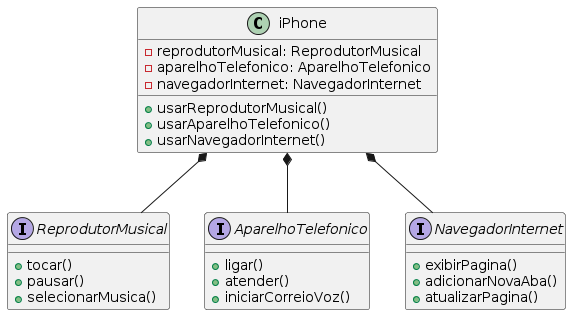

# iPhone Simulator

Este é um simulador simples de iPhone que demonstra as funcionalidades básicas de um iPhone, como reprodutor musical, aparelho telefônico e navegador de internet.

## Funcionalidades

- **Reprodutor Musical**: reproduzir, pausar e selecionar músicas.
- **Aparelho Telefônico**: fazer chamadas, atender chamadas e iniciar correio de voz.
- **Navegador de Internet**: exibir página, adicionar nova aba e atualizar página.

